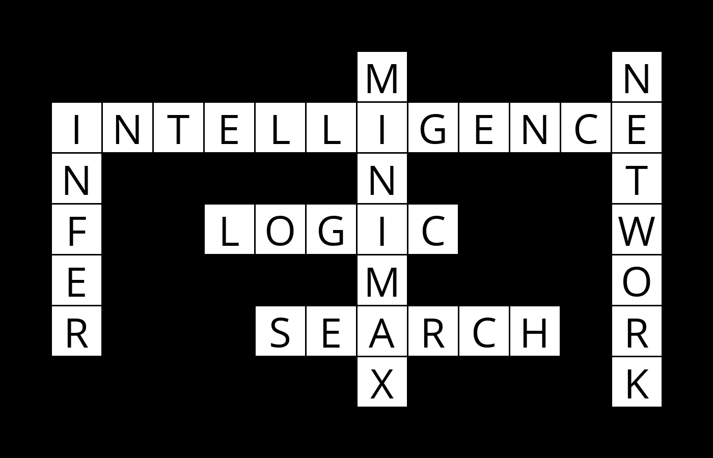

# Crossword
AI that can complete cross-word puzzles

### Background
How might you go about generating a crossword puzzle? Given the structure of a crossword puzzle (i.e., which squares of the grid are meant to be filled in with a letter), and a list of words to use, the problem becomes one of choosing which words should go in each vertical or horizontal sequence of squares. We can model this sort of problem as a constraint satisfaction problem. Each sequence of squares is one variable, for which we need to decide on its value (which word in the domain of possible words will fill in that sequence). 

### Clone:
<code>git clone https://github.com/ahmedivy/crossword.git</code>
### Run:
<code>python generate.py {structure} {words} output.png</code>  
Some structures and words are present in <code>data</code> folder. You can make your own of any kind and AI will complete it, untill its fair. Also, make sure to install python PIL package.
